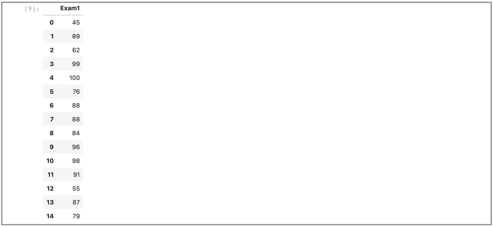

# Introduction to Jupiter Notebooks: Problem Solving

Let's practice the skills we learned during the last lesson on Jupyter Notebooks.

## Create a Spreadsheet of Data

Create a CSV (Comma-Separated Values) spreadsheet as follows.

- Name the spreadsheet file `scores.csv`.
- The first row must be headings only.
- The first three columns must have the following headings: `Name`, `Exam1`, and `Exam2`.
- Below the headings row, there must be 15 rows of data. Fill the rows in with a variety of made-up names and exam scores (assuming that each exam score is between 0 and 100 points).

Upload the spreadsheet into your JupyterLab workspace.

## Create a New Notebook

Create a new xpython notebook named `Jupyter-notebooks-intro-PS.ipynb` in your JupyterLab workspace.

- Be sure that the notebook is using the _xpython_ kernel (NOT the _Python 3_ kernel).

## Add a Markdown Cell

Make the first cell in the notebook a Markdown cell that looks like the following figure.

- Don't forget to set the cell type to _Markdown_.
- Hint: The cell includes a level-1 heading and a level-2 heading.
- Hint: See the [GitHub Markdown Cheatsheet](https://guides.github.com/pdfs/markdown-cheatsheet-online.pdf) for Markdown examples.

Run the cell to make it render the Markdown as pretty headings and text.

## Import the Pandas Library

Add a code cell that imports the Pandas library.

- Import the Pandas library as `pd`.

Run the code cell. (No output should be displayed.)

## Read the Spreadsheet into a DataFrame

Add a Markdown cell that looks like this:

- Hint: The heading in this cell (and all future Markdown cells) is a level-2 heading.
- Hint: To format the `df` variable, we surround the df in backticks (i.e., \`\`s).

Add a code cell that reads the spreadsheet you uploaded into a DataFrame.

- Name the DataFrame variable `df`.

Run the code cell. (No output should be displayed.)

## Display the Contents of the DataFrame

Add a Markdown cell that looks like this:

Add a code cell that displays the contents of the DataFrame.

- Hint: This involves only adding a variable block.

Run the code cell and note the output, which should resemble the following:

## Display an Individual Column in the DataFrame

Add a Markdown cell that looks like this:

Add a code cell that displays a summary of only the data in the Exam1 column.

- Hint: This involves one of the _Lists_ blocks.

Run the code cell and note the output, which should resemble the following:

## Calculate the Average (Mean) Value of a Column in the DataFrame

Add a Markdown cell that looks like this:

Add a code cell that calculate the average value in only the data in the Exam1 column.

- Hint: First, store the Exam1 column as a list in a new variable (call it `exam1`). Then, run the `mean` operation on the `exam1` variable.

Run the code cell and note the output, which should resemble the following:

## Calculate the Average (Mean) Values of All Columns in the DataFrame

Add a Markdown cell that looks like this:

Add a code cell that calculates the average value for each column in the DataFrame.

- Hint: This can be done by calling the `mean` operation on the entire DataFrame.

Run the code cell and note the output, which should resemble the following:

## Display a Summary of Descriptive Statistics for Each Column in the DataFrame

Add a Markdown cell that looks like this:

Add a code cell that displays a summary of descriptive statistics for each column in the DataFrame.

- Hint: This can be done by calling the `describe` operation on the entire DataFrame.

Run the code cell and note the output, which should resemble the following:

***Congratulations! You've completed the first problem-solving notebook!***
